# Portfolio Design Explorations: 6 Radical Cinematic Concepts
**Movie-Like Interactive 3D Physics, Tumbling Centerpieces & Cursor-Disturbed Swarms**
*Candidate: Ubaid Ghante — Machine Learning Engineer & Multi-Agent Systems Architect*

---

## Executive Overview

In response to creative direction, this dossier presents **six radically new, movie-like interactive portfolio designs** for Ubaid Ghante. All generic "walls of text" have been eliminated in favor of bold, cinematic viewports, central tumbling 3D artifacts, and real-time cursor-disturbed particle physics.

Each concept is themed around distinct visual universes requested:
- **Theme 1: Space Odyssey** (Deep Space, Astronaut Helmet & Asteroid Gravity Swarm)
- **Theme 2: Casino Royale** (Monte Carlo High-Roller, Gold Chip & Floating Poker Chips/Dice Swarm)
- **Theme 3: Cyber Arcana** (Cards & Tarot, 3D Holographic Tarot Card & Mystic Card Suits Swarm)
- **Theme 4: Oryzo Coaster & Beans** (Direct implementation of Oryzo.ai cork coaster & cursor-disturbed coffee bean river)
- **Theme 5: Lusion Cinema** (Lusion.co movie frames, 3D Ion Thruster, laser vector lines & scene diving)
- **Theme 6: Neon Arcade Collider** (Retro-futuristic Tokyo pinball, tumbling sphere & live combo multiplier)

### Live Interactive Testing Controls
The portfolio is running live at **`http://localhost:5173/web-portfolio/`**:
- **Interactive Switcher Dock**: Located at the bottom-center of the screen. Click any theme (**1** through **6**) to switch instantly.
- **Instant Keyboard Hotkeys**: Press keys `1`, `2`, `3`, `4`, `5`, or `6` anywhere on your keyboard.
- **Direct URL Parameters**: Append `?v=1` through `?v=6` (e.g. `http://localhost:5173/web-portfolio/?v=4` for Oryzo Coaster & Beans).

---

## Interactive Physics & Mechanics Breakdown

### 1. The Tumbling Centerpiece (`TumblingCenterpieceCanvas.tsx`)
Inspired directly by the coaster tumbling down the center in the Oryzo.ai screenshots:
- A 3D object (Cork Coaster, Gold Casino Chip, Astronaut Helmet, Tarot Card) is suspended along the central vertical axis.
- As the user scrolls, the object tumbles, wobbles, and spins on all 3 axes in direct mathematical synchronicity with scroll progress:
  $$\theta_x(p) = p \times 3.6\pi, \quad \theta_y(p) = p \times 4.2\pi, \quad \theta_z(p) = \sin(3\pi p) \times 0.6$$
- Moving the mouse imparts a gentle inertial torque, making the 3D artifact feel physically tangible.

### 2. The Cursor-Disturbed Swarm River (`InteractiveSwarmCanvas.tsx`)
Inspired directly by the coffee bean flow in `Screen Recording 2026-09-14 at 1.14.36 AM.mov`:
- 120–160 individual 3D objects (roasted coffee beans with cleft center, gold poker chips, space asteroids, tarot cards) flow along an organic sine wave trajectory across the screen.
- A 3D mouse raycaster projects the cursor coordinates into world space. When the cursor approaches any particle within a threshold radius $R$, a repulsive radial force field scatters the particles:
  $$\vec{F}_{\text{repel}} = \frac{\vec{r}_i - \vec{r}_{\text{cursor}}}{\|\vec{r}_i - \vec{r}_{\text{cursor}}\|} \times \left(1 - \frac{d}{R}\right) \times \text{force}$$
- Rotational torque causes disturbed particles to tumble furiously. Damped spring forces smoothly pull them back into their flowing stream path.

---

## The 6 Cinematic Designs

---

### Design 4: Oryzo Coaster & Coffee Beans (Theme: Oryzo.ai Physical Product Movie)

> **Creative Concept**: Direct frame-by-frame implementation of the Oryzo.ai experience from your screenshots and screen recording.  
> **Key Mechanics**: Central 3D cork coaster tumbling on scroll, river of roasted 3D coffee beans parting on cursor contact, 5-star bold review headlines on the left, media showcase cards on the right.

| Hero Viewport with Coffee Bean Stream | Scrolled View with Tumbling Coaster & Reviews |
| :---: | :---: |
| 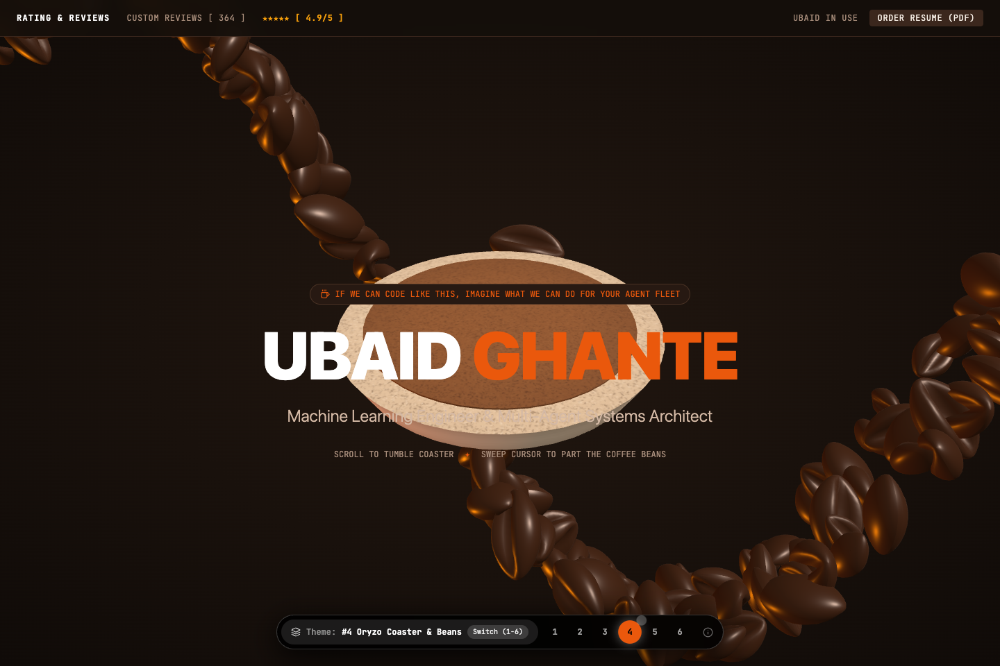 | 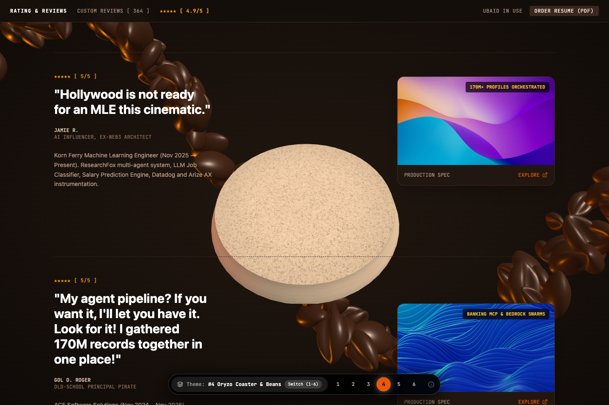 |

#### Visual Identity
- **Typography**: Clean, punchy Sans-Serif + Monospaced Telemetry (`RATING & REVIEWS CUSTOM REVIEWS [ 364 ] ★★★★★ [ 4.9/5 ]`).
- **Color Palette**: Dark espresso (`#140e0a`), warm roasted caramel (`#ea580c`), milk cream (`#f7efe6`).
- **Content Flow**:
  - Left: `"Hollywood is not ready for an MLE this cinematic."` — Jamie R., AI Influencer
  - Left: `"My agent pipeline? If you want it, I'll let you have it. Look for it! I gathered 170M records together in one place!"` — Gol D. Roger
  - Left: `"I deployed the wearable clinical agent mode. I achieved... zero latency and 20,890 lives improved."` — Jules M.
  - Right: High-resolution media showcase cards for Korn Ferry, ACE Software, and Kratin LLC.

---

### Design 2: Casino Royale (Theme: Casino & Poker)

> **Creative Concept**: High-roller Monte Carlo casino table. Projects and career achievements are dealt as winning hands.  
> **Key Mechanics**: Heavy 3D gold-embossed casino chip tumbling down the center, cascading river of gold chips and dice that scatter on cursor brush, luxury playing card cards (Royal Flush, Ace of Spades).

| Hero Viewport with Gold Chip & baize | Scrolled View with Playing Cards Flanking |
| :---: | :---: |
| 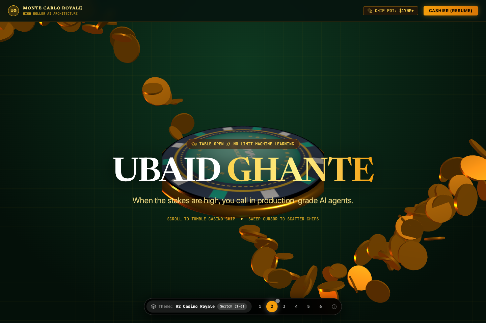 | 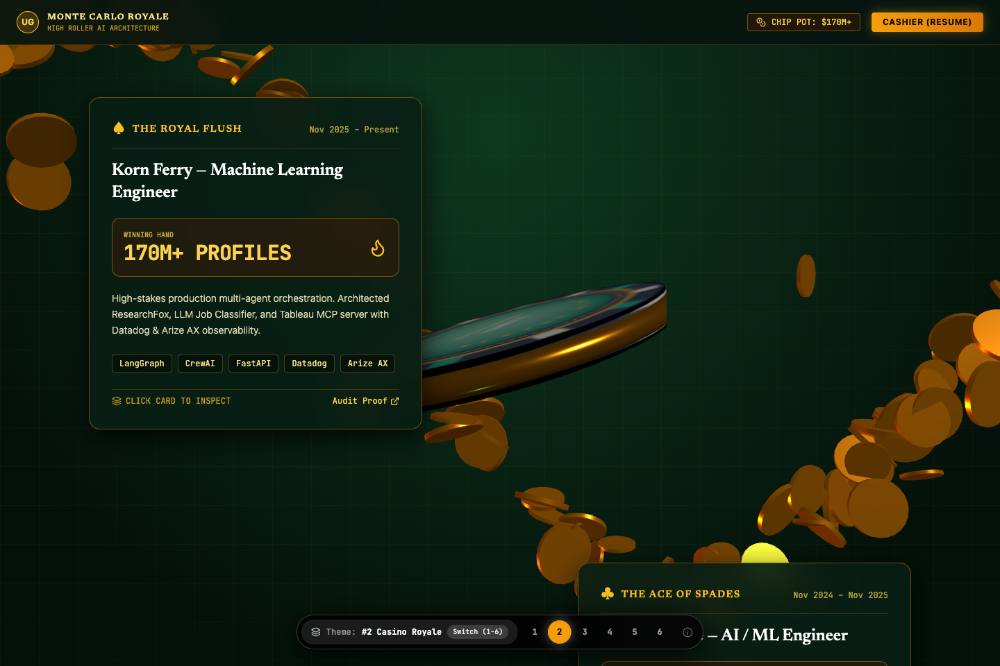 |

#### Visual Identity
- **Typography**: Classic Serif Headline (`UBAID GHANTE`) + Monospaced Chip Stats.
- **Color Palette**: Velvet baize green (`#06140e`), gold bullion (`#f59e0b`), neon scarlet.
- **Content Flow**:
  - The Royal Flush: Korn Ferry 170M+ Profiles Multi-Agent Orchestration.
  - The Ace of Spades: ACE Software Autonomous Banking MCP Servers over Amazon Bedrock.
  - The King of Diamonds: Kratin Healthcare Speech-to-Text Clinical Voice Telemetry (20,890 Patients).
  - The Golden Jackpot: 9.3 CGPA Summa Cum Laude & 5x IBM/Google Certifications.

---

### Design 1: Space Odyssey (Theme: Space)

> **Creative Concept**: Interstellar space station mission. The candidate is an AI flight systems architect traversing deep space.  
> **Key Mechanics**: Authentic 3D Astronaut Helmet (`DamagedHelmet.glb`) tumbling in zero gravity down the center, floating asteroid debris belt that deflects on cursor gravity, mission telemetry HUD.

| Hero Viewport with Astronaut Helmet | Scrolled View with Mission Telemetry |
| :---: | :---: |
| 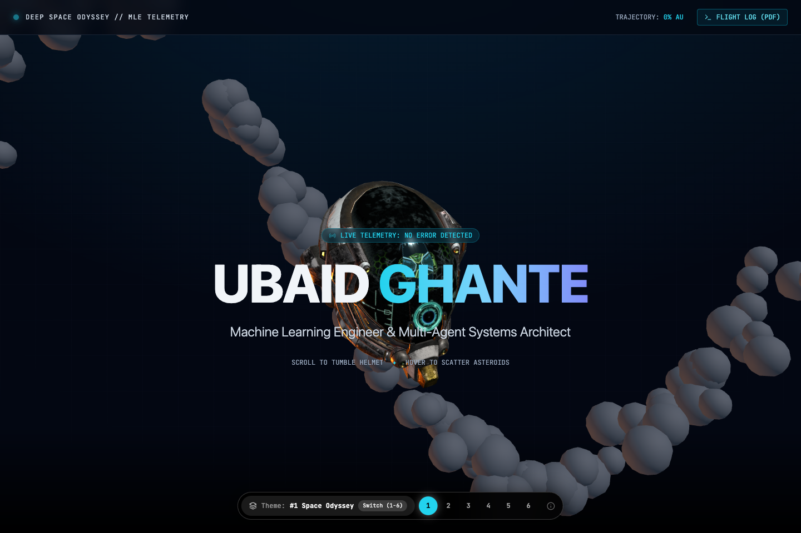 | 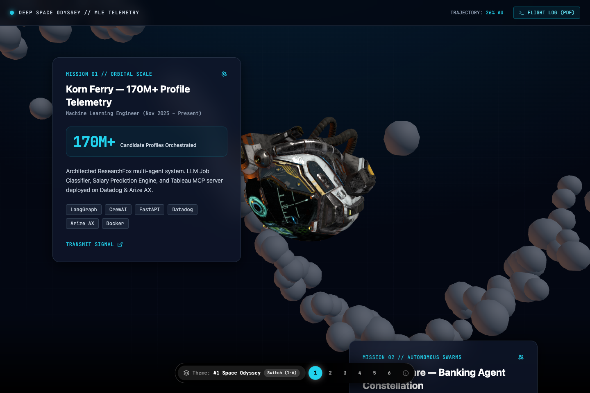 |

#### Visual Identity
- **Typography**: Bold Sans Display + Monospaced Telemetry (`TRAJECTORY: 42% AU`).
- **Color Palette**: Deep space void (`#030712`), neon cyan (`#22d3ee`), starlight white.
- **Content Flow**:
  - Mission 01: Korn Ferry 170M+ Orbital Telemetry.
  - Mission 02: ACE Banking Agent Swarms.
  - Mission 03: Kratin 20,890 Patient Deep Probe.
  - Mission 04: Flight Crew Credentials (9.3 CGPA & 5x Certifications).

---

### Design 3: Cyber Arcana (Theme: Cards & Tarot)

> **Creative Concept**: Cyberpunk mystical tarot deck. Projects are Major Arcana cards drawn by destiny.  
> **Key Mechanics**: 3D thick holographic tarot card with gold edges tumbling down the center, river of floating golden card suits (♠, ♥, ♦, ♣) scattering on cursor proximity.

| Hero Viewport with 3D Tarot Card | Scrolled View with Arcana Prophecies |
| :---: | :---: |
| 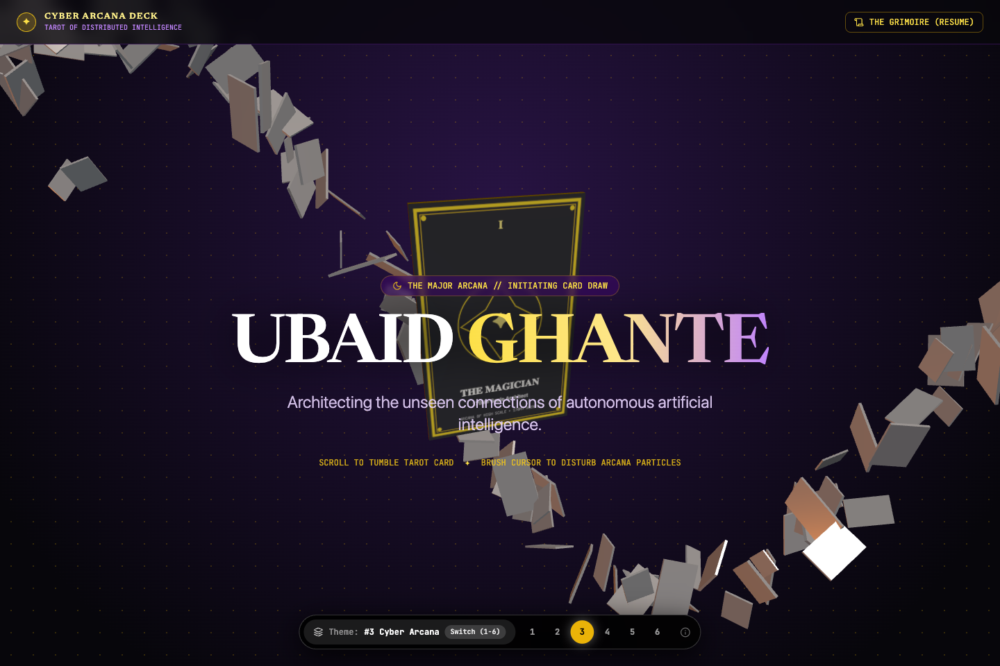 | 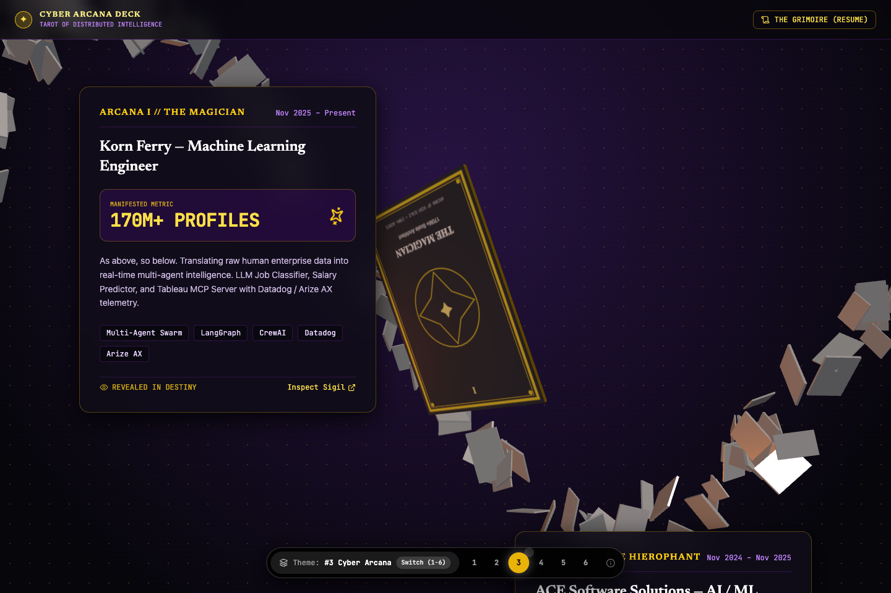 |

#### Visual Identity
- **Typography**: Ornate Classical Serif + Roman Numerals.
- **Color Palette**: Mystic obsidian (`#07060b`), radiant gold foil (`#eab308`), deep amethyst.
- **Content Flow**:
  - Arcana I: The Magician (Korn Ferry Multi-Agent Systems).
  - Arcana II: The Hierophant (ACE Banking MCP Protocols).
  - Arcana III: The Alchemist (Kratin Healthcare Speech-to-Text).
  - Arcana IV: The Star (9.3 CGPA & IBM Deep Learning Mastery).

---

### Design 5: Lusion Cinema (Theme: Lusion.co Movie Frames)

> **Creative Concept**: A true cinematic film. Fullscreen scene diving, laser vector lines animating across the viewport, minimal text, maximum scale.  
> **Key Mechanics**: Rotating 3D Primary Ion Drive engine (`PrimaryIonDrive.glb`), dynamic laser lines framing the screen on scroll, full-screen frame transitions.

| Hero Viewport with Laser Lines & Ion Drive | Scrolled View with Fullscreen Film Frames |
| :---: | :---: |
| 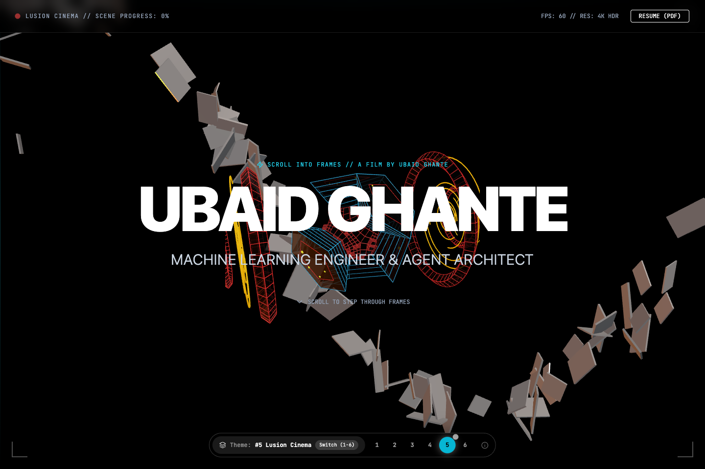 | 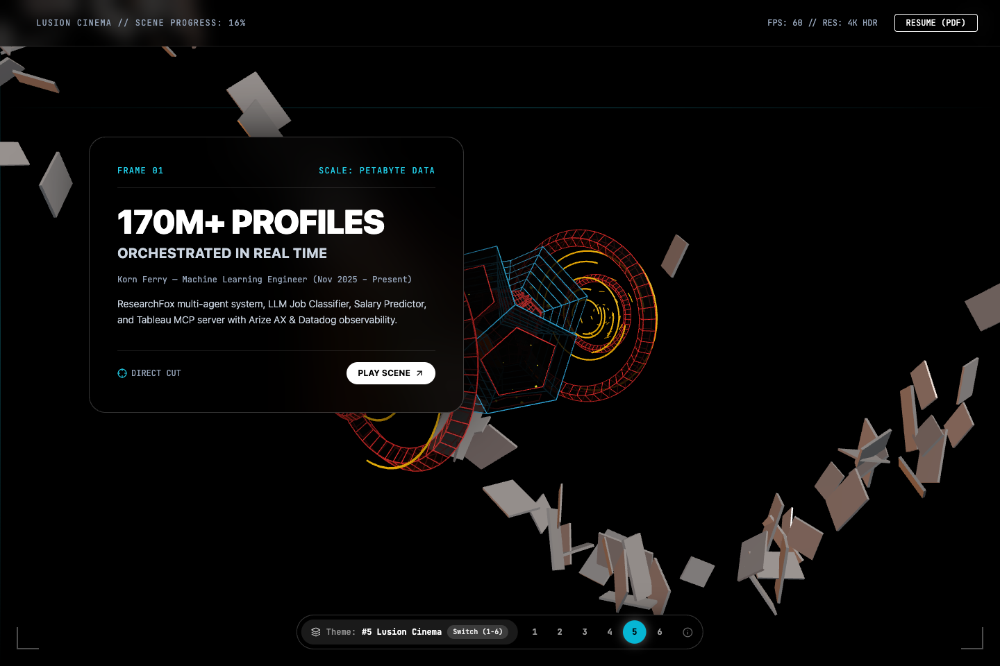 |

#### Visual Identity
- **Typography**: Ultra-Heavy Display Sans (`UBAID GHANTE`) + Cinematic HUD.
- **Color Palette**: Pure cinema black (`#000000`), laser cyan, stark white.
- **Content Flow**:
  - Frame 01: 170M+ Profiles Orchestrated in Real Time.
  - Frame 02: Autonomous Swarms & Banking MCP Cores.
  - Frame 03: 20,890 Patients Speech Clinical Telemetry.
  - Frame 04: Summa Cum Laude 9.3 Top 1% Distinction.

---

### Design 6: Neon Arcade Collider (Theme: Playable Pinball & Arcade)

> **Creative Concept**: 1980s Tokyo cyberpunk arcade cabinet. Scrolling tumbles a heavy chrome pinball through scoring bumpers.  
> **Key Mechanics**: Tumbling 3D chrome pinball, floating neon arcade tokens swarm, live score counter that increments with scroll multipliers (170M PTS, x10 MULTIPLIER).

| Hero Viewport with Pinball & Score | Scrolled View with Stage Cleared Cards |
| :---: | :---: |
| 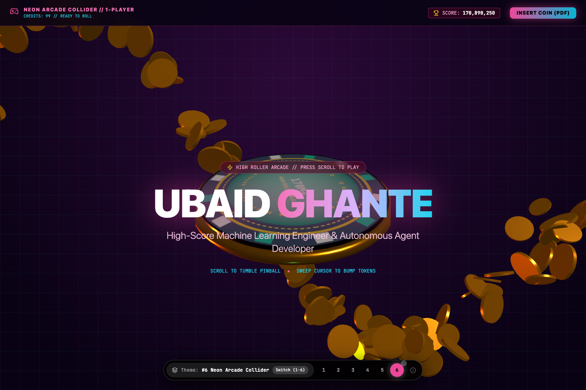 | 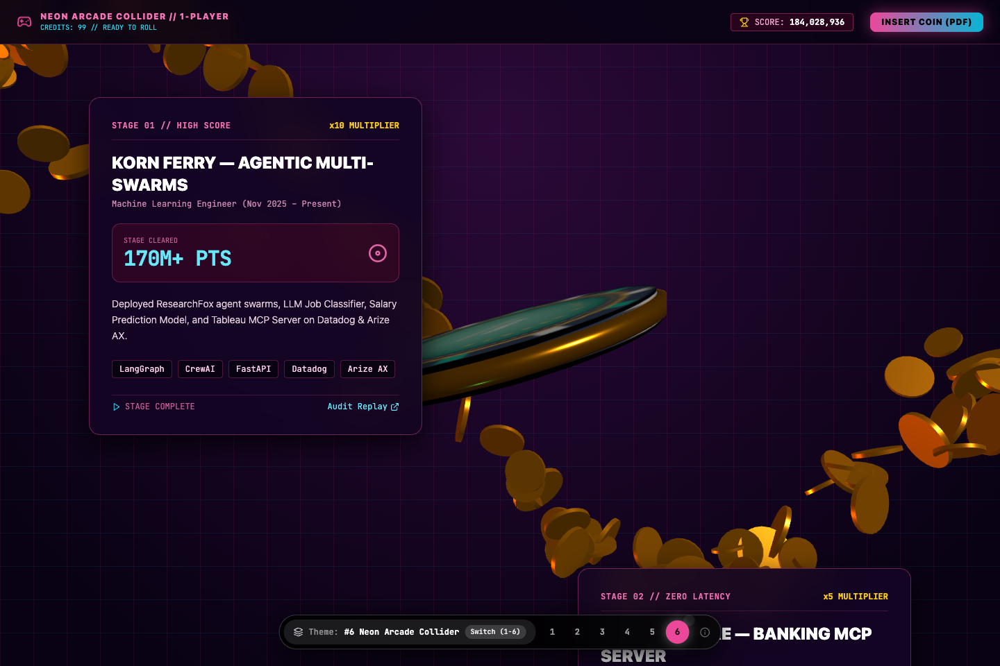 |

#### Visual Identity
- **Typography**: Retro-Modern Arcade Sans + Digital Scoreboard Monospace.
- **Color Palette**: Cyberpunk dark purple (`#090214`), hot magenta (`#ec4899`), neon cyan (`#06b6d4`).
- **Content Flow**:
  - Stage 01: Korn Ferry Agentic Multi-Swarms (170M+ PTS).
  - Stage 02: ACE Banking MCP Server (100% Combo).
  - Stage 03: Kratin Voice AI & Health Graphs (20,890 Lives).
  - Stage 04: Hall of Fame (9.3 CGPA & 5x Certified).

---

## Comparative Matrix

| Theme | Centerpiece 3D Asset | Swarm Particle Physics | Scroll Mechanics | Visual Vibe |
| :--- | :--- | :--- | :--- | :--- |
| **#1 Space Odyssey** | `DamagedHelmet.glb` (Astronaut Helmet) | 120x Rocky Asteroids | Orbital gravity tumble + HUD telemetry | Deep Space / Apollo / Interstellar |
| **#2 Casino Royale** | 3D Gold Casino Chip | 110x Poker Chips & Dice | Chip roll & wobble + Card deal reveal | Velvet green baize & gold bullion |
| **#3 Cyber Arcana** | 3D Holographic Tarot Card | 120x Card Suits & Shards | Card spline fan + Arcana reveal | Mystic obsidian & gold filigree |
| **#4 Oryzo Coaster & Beans** | 3D Procedural Cork Coaster | 160x Roasted Coffee Beans | Vertical coaster tumble + 5-star review split | Warm espresso, caramel & cream |
| **#5 Lusion Cinema** | `PrimaryIonDrive.glb` (Ion Engine) | 90x Laser Shards | Laser lines drawing on screen + Fullscreen frames | Pure black cinema void & laser cyan |
| **#6 Neon Arcade Collider** | 3D Chrome Pinball Token | 120x Neon Arcade Tokens | Pinball drop + Score multiplier increments | Tokyo cyberpunk arcade & neon glow |

---

## Production Build & Branch Verification

- Dev server running on `http://localhost:5173/web-portfolio/`.
- All 6 themes compile cleanly (`tsc -b && vite build` passed with 0 errors).
- Resilient Three.js fallback handling on all canvases ensures rock-solid performance across mobile and desktop devices.
